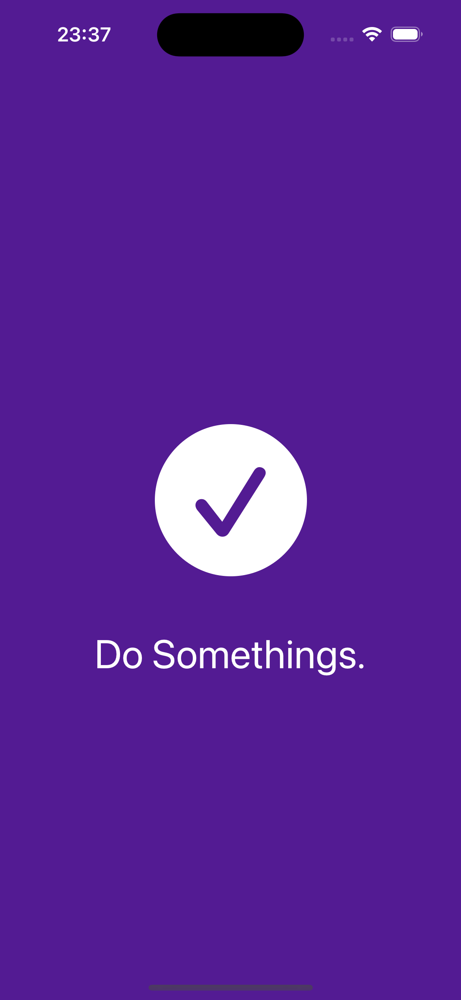
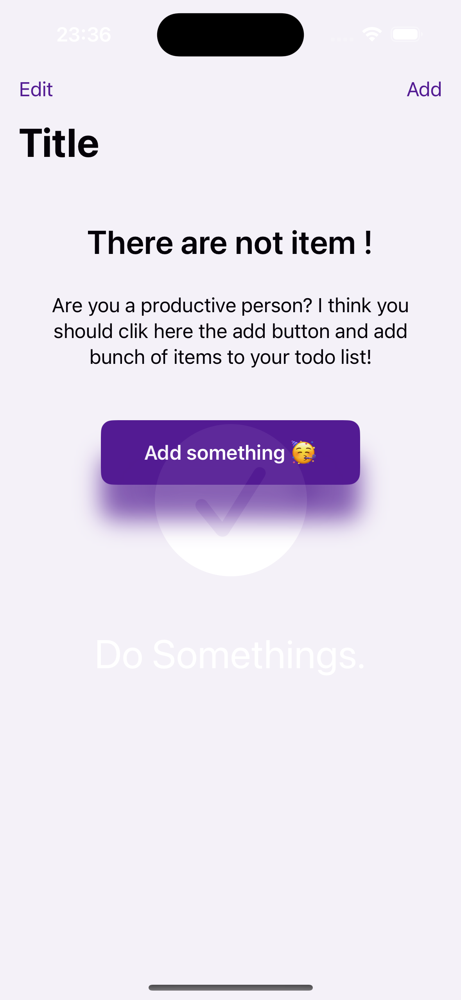
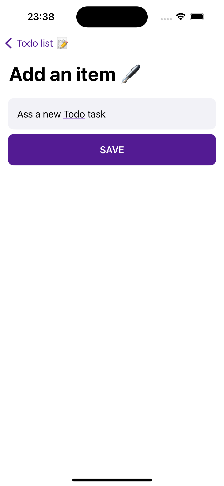
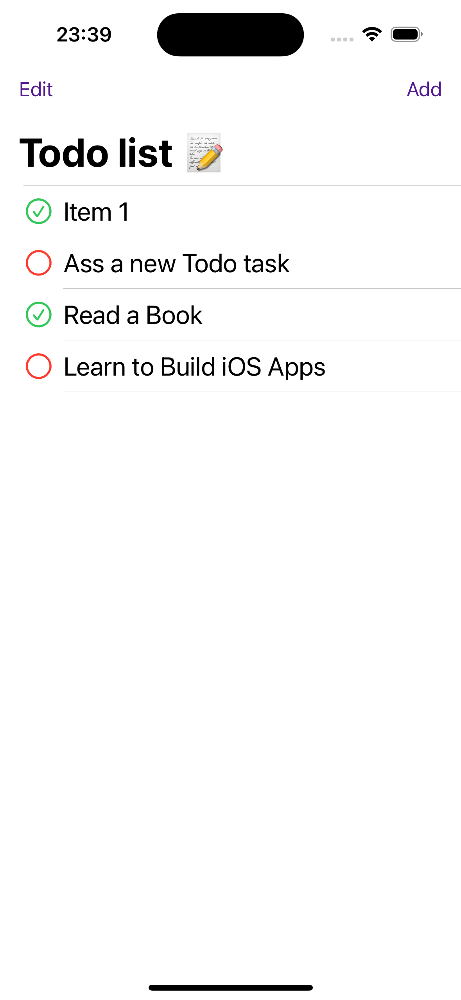
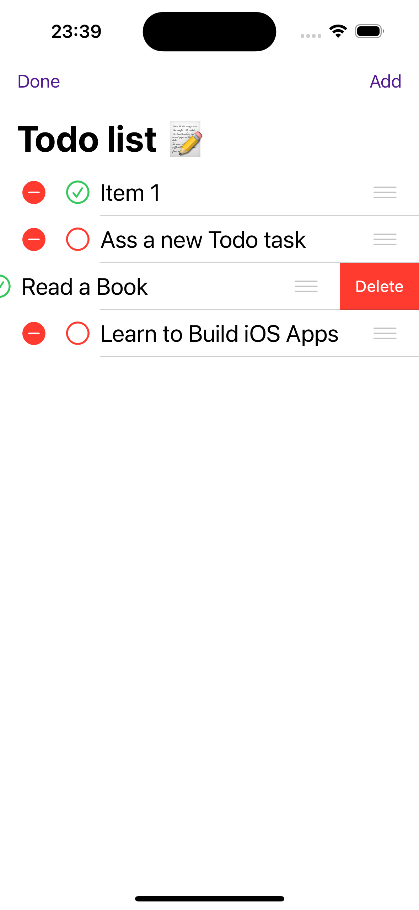

# SwiftUI Todo List (Beginner Level) 
Create a to-do list from scratch using SwiftUI with an MVVM architecture model. 

<table>
  <tr>
    <td> </td>
    <td> </td>
    <td> </td>
    <td> </td>
    <td> </td>
  </tr> 
</table>

## New knowledge gained during the project
1. Build Todo List in SwiftUI with MVVM architecture.
2. Create a custom data model for Todo items in SwiftUI.
3. Add a ViewModel with @EnvironmentObject in SwiftUI.
4. Save and persist data with UserDefaults.
5. Basic animations in SwiftUI app.
6. Adapt SwiftUI app for iPad, Landscape, and Dark Mode.
7. Adding an App Icon and Launch Screen to SwiftUI.
   
## Getting Started
To get started with this project, follow the instructions in the README to set up your development environment and run the app locally.
```
clone this repo in xcode and build it
```

## Thanks
1. [Build Todo List in SwiftUI with MVVM architecture by Swiftful Thinking With Nick](https://www.youtube.com/watch?v=wEf1YS4vyW8&list=PLwvDm4VfkdpheGqemblOIA7v3oq0MS30i&index=1)
2. Contribution-Mail: tchioidriss@yahoo.fr 
